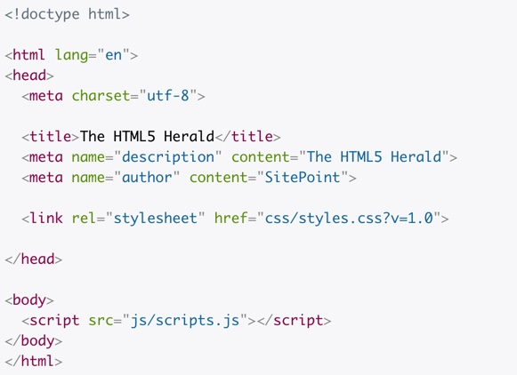
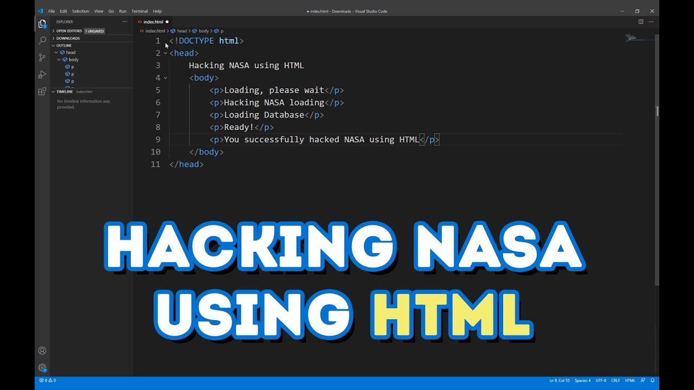

# HTML5

Where to start, where to start?? Wait what is HTML? not to mentinon HTML5? Well lets put it simply and in terms I think we all can understand. HTML5 is the buidling blocks of all things on the web.

Let's think of it like this If you're building a house you need a frame, walls, roof, floor. You get the point. HTML5 is like this but for the web all web pages are built with it and use it so what is the 5 for? The 5 in HTML5 means that we are now in the 5th iteration (if thats even the right word for this.) So in short there have been different versions on it since it's first inception. HTML stands for *Hypertext markup language*

What does it look it like? Well..  
`<h1> this is a main header tag </h1>`
Well, okay maybe I could give a better example below is a typical HTML5 boilerplate.

You can see there are a few different components here but this is a very basic structure I won't go into too much here since this is a very basic overview of the most building block of the web we can talk more about that at a later time. 

Well as you know now all you need to do is learn HTML then you will well on your way to hacking *Nasa* maybe even *SpaceX* Yeah thats right we are coming for you too Elon. 

In all seriousness tho HTML5 is the very basic later we will take a look at this later and actually talk about how it works and all the semantics..

*If you'd like to join the community and make your own posts on here and share your experiences Reach to me VIA social media or Email and I'd be more than happy to feature your writings!*