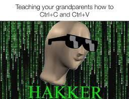

# introduction part 2


Here goes part two to this introduction into my life. 
If you'd like to catch up on part one you can click [***here***](https://jrdevsblog.com/Introduction) So without further ado.  


So it was like a revelation hit me, I enjoyed this, I enjoyed being in control. I tried using it everywhere I could, at this time *mySpace.com* was a huge deal I remember typing in the messages box inline CSS something like this. 

```css
<h1 color="red">
 /* or */
<P font-size="22px">
```

I know I know this again is very rudamentary, but do you know how cool I looked to all my friends when I could do something that simple. Now I know you're probably thinking, so you like coding to show off little css tricks to your friends? Well no, and yes. I mean C'mon who didn't do something like that.  

Who didn't watch the matrix and see Keanue Reeves hacking in a backroom and not be in awe. That is probably an old time joke at this point but you get the point.  



Okay jokes aside this led me into playing aroun with the myspace layouts and themes if you know you know. The ones that made text scroll on the screen, or hearts pop up and dissapear all over anything I could just to tweak it in any small yet meaningful way.  

After some time I did fall out of the programming world. Life happens so let's jump ahead a few years. Now I'm around 22 or 23 years old. I have an older step brother who owns his own web development company he lives in another state and we aren't particularly close. He build sites using wordpress for his clients as far as I know. At this time I asked if he would be interested in helping me get back into it.

Well he was willing to help me even offered to pay for me to take some online classes. I wasn't really sure of what I was getting myself into I was working two jobs and had a significant other who took up a lot of my time. Sad to say only a few weeks of an hour or two here and there. Yeah I know some dedication right? Then some snags with syntax and it not being very clear on how it should be written I got frustrated and quit.  

With hind sight now I see if I would have spent a few seconds on google I would have resolved my issue quickly and then moved forward.

I don't know why but at this point I felt like if I had to google something then I was doing it wrong. I look back now and laugh because I spend as much time on google or more as I do writing code. hahahah maybe that is just me.

**Stay tuned for part 3**

*If you'd like to join the community and make your own posts on here and share your experiences Reach to me VIA social media or Email and I'd be more than happy to feature your writings!*


