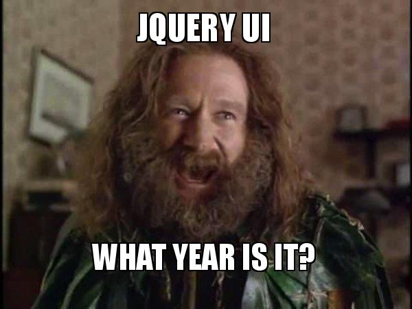

# 100 Days of code part 2

Well it's been a little while since I've updated where I was at with this so let's right into it I'm going to do an overview of what I've done nothing too in depth.

So since the first update I was woorking with bootstrap, after that was jQuery which is a javascript library acutally it was the most popular library of it's time and it still widely used 
in fact according to a survery by **[w3tech.com](https://w3techs.com)** jQuery is used by 77.6% of websites out there as of 2020 which is a market share of about 96%.  

Yes there are drawbacks to jQuery but let's be honest nothing is perfect.  

Well in short even tho it's not what is in any more like React, Angular or Vue it is still a good idea to know it and have a basic idea of how it works. Who knows when you might get stuck working on some legacy code. Maybe I will even build a project using it just to do it.  

Next up was Sass, whichi is a css preprocessor It does offer a lot of cool things you can't do with css I actually use a little of it to build this blog site here.  

With sass you have access to a lot of cool things like nesting which allows you to structure your css in a way that makes sense with the rest of your site working for a top down perspective.  

There are some other cool features I won't really break those down here if you'd like you read read the official docs **[Here](https://sass-lang.com/guide)** I'd personally taking a little bit of time to learn Sass even if you don't think you will use it won't take a lot of time to at least get familiar with it and it never hurts to expand you're knowledge base.  

Now to catch things up here we are at day 08/100 and we are working on react very basic things so not a lot to report on but as of right now I'm working on props and how they are defined and called.  

Once we get a little more into React the next post will focus on this more. 

Well until next time... Happy coding!  

**Stay tuned for part 3**

*If you'd like to join the community and make your own posts on here and share your experiences Reach to me VIA social media or Email and I'd be more than happy to feature your writings!*

