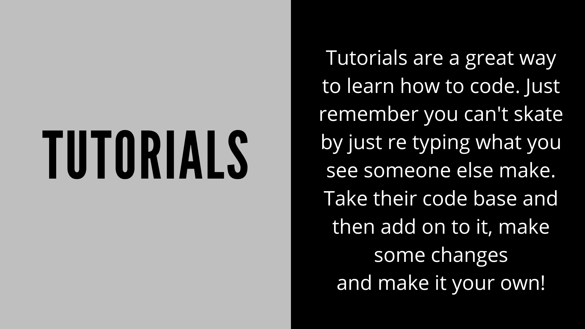
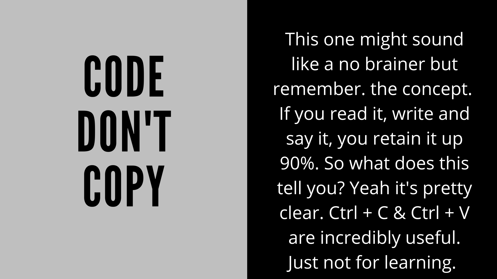
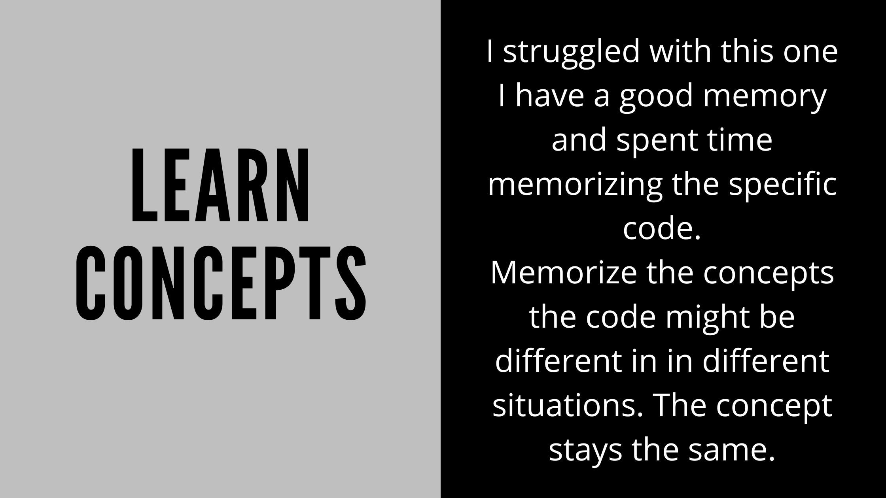
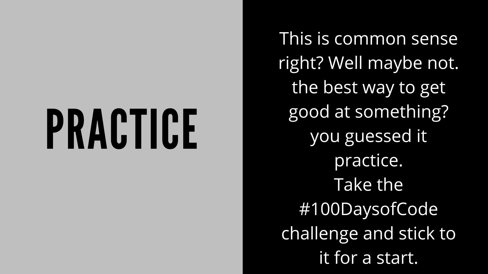

# 5 tips for learning code

I know, I know there are probably a million or more of these lists out there. Hey maybe mine will click with a few people that all the others didn't right?

I don't want to take up too much time so let's just get into them!  

Also I'm going to create a quick list here I encourage you to read them all but if you'd prefer to jump around then go ahead!  

1. [link to tutorials](#tutorials)
2. [link to code don't copy](#codedontcopy)
3. [link to learn concepts](#learnconcepts)
4. [link to get inspired](#getinspired)
5. [link to practice](#practice)

# Tutorials.  

Yeah this is obvious but I think the part of it that so many aspiring develops get stuck is what we affectionately refer to as "Tutorial hell" What is this and what does it mean for you. Tutorial hell to put it simply is where you get stuck watching tutorial after turotial and following the the code letter by letter syntax by syntax. At the end of it tho you can remember how you did something or what you did... Yeah it can be pretty crippling and a deathblow to your confidence in learning code.

How do you break away from this? Take the tutorial you are following and then make changes play with the code break it! it can be fixed. You have to play with it make changes, make it your own.

What is the significance of this? It is quite well known "reverse engineering" something can really help with the understanding of it, besides code isn't glass. I mean it is easy to break but it can be fixed just as easily. Go crazy and just break it rewrite change it and have fun!

  

# Code don't copy

Let's start this one with a well known saying. I'm sure at some point or another you heard this in school and they probably beat it into your head until you wanted to throw a text book. (hopefully you didn't). Anyways There is a reason why and it's this.

> When you read, write and say speak something you retain up to 90% of it.  

Well there is a reason for this backed by science or something I'm sure. This isn't a science or pshychology class so I wont harp on that too much.  

Back to the point which is CTRL + C and CTRL + V are very useful for time saving and in a real world situation can save you tons of time. 

If you are learning somehting new tho you need to read it slowly and thoroughly read it more than once. Then write it out don't copy and paste it. That is the cheap way, cheap becuase you are cheating yourself out of really doing it and really learning what you are doing.  

# Learn concepts

This one is one of the hardest for me. Let me explain. I've always had a great memory and I have relied on this heavily in school it was great since they only want you to reciprocate what it is they teach you and there is little out of the box thinking. (refering to highschool of course).  

I would watch tutorials re create the code and make it my own I would memorize the code exactly after writing it a few times. Then when doing it on my own using that code I memorized so many times it wouldn't work.... WHY?! it would bother me some much..

Until I learned the exact code doesn't matter the most what matters is the concept of how it works and why. Not just the syntax. So what was my problem? It was simple I thought it would work universally and thats not the case.

Now if you get the concept then you can google the syntax or the small details as long as you know how the overall code works that is the most important part. 

# Get inspired

This one is exactly how it sounds. **GET INSPIRED!!** I know, facetious right? Not really actually I think this one applies more to front end develops since we can just look at other sites and draw inspiration. Although I'm sure it can be used in other areas? Maybe. I don't know.  

Back to the point use websites like [awwwards.com](https://awwwards.com) or [dribble.com](https://dribble.com) Where some of the best most creative and talented developrs have built some amazing projects and host them for you to look at.  

These are some amazing resources try to re create them with HTML and CSS of even just take some ideas from them and implement them into your own project.

# Practice

This list seem a little redundant and like it should be common snese? Yeah I know but bear with me just a bit here.  

This does tie into the 2nd point in this list which was, say it with me "Code don't copy". Well well well. Would you look at that soemthings do tie together eh?  

In all seriousenss the only way to get better is by doing it. Build big projects, small projects, all projects. Just build something. Build a personal portfolio. Build an idea for a fictious business, even something like just a landing page, slow progress is still progress right?  

You don't have to build 5 full fledged websites.. I mean if you do great! Do you have to? No, absolutely not, start with a well designed landing page, or a form submission page with good UI / UX design.  

> 1 hour of doing is better than 10 hours of thinking.  

While I don't agree with this 100% in this situation I'm going to go with it. keep coding try to do it every day. Coding isn't as easy as some people make it seem or eve say. Let's be honest there are egos in tech as much if not more than other professions don't.

I will leave you with this saying.

> The flower just blooms, it does not concern it's self with the other flowes and when they bloom. It just does it.

*If you'd like to join the community and make your own posts on here and share your experiences Reach to me VIA social media or Email and I'd be more than happy to feature your writings!*

