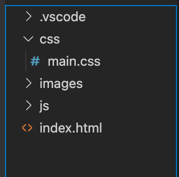

When we left off in part 1 which you can view *[HERE](https://jrdevsblog.com/html5-in-depth)* we left off with a very basic html skeleton that looked something like this.  

  

So I'm sure we can all agree this is very boring not to mention it's literally just one header and an h1 tage that says hello world (don't mind the typo of gattery lol). Well no website can funtion on this alone right? Let's add more to it!  

as of right now our code looks a little something like this.  

```
<!DOCTYPE html>
  <head>
    <title>My Project</title>
    <link rel="icon" type="image/x-icon" href="./assets/favicon.ico" />
    <meta charset="utf-8" />
    <meta name="viewport" content="width=device-width, initial-scale=1" />
    <link rel="stylesheet" href="css/main.css">
  </head>
  <body>
      <Header>
          <nav>
              <ul>
                  <li>Home</li>
                  <li>Gallery</li>
                  <li>Contact US</li>
              </ul>
          </nav>
      </Header>
      <section class="main">
          <h1>
              Hello World
          </h1>
      </section>

  </body>
</html>
```

Well we are going to add some content to this now and get things to look a little more like an actual website we are going to build a small yet functional portfolio site where you will be able to post your work. Of course you should take this site and then make changes to it so it isn't a direct copy of mine.  

now so far our header shows home, gallery and contact us. We are going to change these to show home, projects and contact. small changes I know but it will be more consistent with what we are building.

so lets go in the nav section and make those changes so now our code will look more like.  

```
    <nav>
      <ul>
        <li>Home</li>
        <li>Projects</li>
        <li>Contact</li>
      </ul>
    </nav>
```

Great now let's change our header to something more Subtle I'm going to change it to "My Portfolio" you of course can change this to what ever you want.

and let's add a p tag and give a little bit of details about yourself. Mine willb e pretty simple like this **"Welcome to my portfolio! My name is Brandon and I'm a junior frontend developer, studying Html5, css3 and javascript."**  

now we are going to create a folder that will hold our images that we are going to add in to the project. (see picture below)   

Well now that we have this done let's go ahead and add those photos so we are going to use the img tag so it should look like this. Also let's wrap that in a div with the class of "project-list".

```
  <div class="project-list">
    
    
    
  </div>
```

A few things we will point out here. The "src" part of this tag is where the specify the image location since we house ours in an image folder it would look something like this. `` Now the "alt" tag is important because it tells web crawlers like google understand the image and it helps with people who may have imapairments and use screens readers.  

So i'm just going to use from stock photos that you can get from a website like [PEXELS](https://pexels.com) so it's not going to be real project images. after you download your images, name them and put them in you images folder they will be displaying on your basic site now.  

As of right now this wont look very good depening on the size you downloaded the images at they will be cover a massive amount of your website.

Well that it is for part two of this tutorial keep up for part 3 where will create add some social links and a footer to the site. 

**Stay tuned for part 3**

*If you'd like to join the community and make your own posts on here and share your experiences Reach to me VIA social media or Email and I'd be more than happy to feature your writings!*


