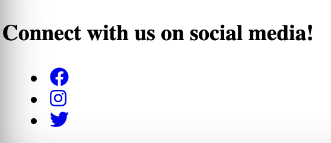

Let's get right into part 3 here in the post [clickhere](http://localhost:8000/html5-in-depth-part-2/) We added some images to our website which at the moment are way to large for our website. We added and talked about the significance of the "alt" tag so now we are going to add our footer to the site and then our social links so we can connect with our visitors on any platform they prefer.

So what we are looking to do here is finish the basic skeleton of our website the header the main section and the footer. 

So now we should add the code and talk about what we are seeing here. 

```html
<footer>
  <h3>Connect with us on social media!</h3>
    <ul>
      <li><a href="https://facebook.com/myproject"><i class="fab fa-facebook"></i></a></li>
      <li><a href="https://instagram.com/myproject"><i class="fab fa-instagram"></i></a></li>
      <li><a href="https://twitter.com/myproject"><i class="fab fa-twitter"></i></a></li>
    </ul>
</footer>
```

So in this code above we have the "footer" sepcifically called out. Our h3 calling attention to this section and telling our audience what it is for, then of course since we will be listing our social media links we want to put them in an unordered list. 

Now since we will be linking to an external site we will add our "a" tag with the "href" attribute and then of course add the url we want this to be directed too. and finally we have the "i" with a class and this is where the icons come from. Now these icons come from the website fontawesome you can acess these either via the CDN or by creating a free account and setting up a kit.I will not be explaining all of this but if you [CLICK HERE](https://fontawesome.com) this will direct you to their website and you can get more information there. 



Don't worry about how it looks the css will come later and we will make it look all nice and pretty. 

lastly we can add in a small TM for the very bottom of the site just to look more official and we can add that with a simple code 

&#8482; my project

Well that is it this was a small section but still important in it's own right.

If you would like to go back and catch up on this then follow the links below!.

- [Part One](https://www.jrdevsblog.com/html5-in-depth/)
- [Part Two](https://www.jrdevsblog.com/html5-in-depth-part-2/)

**Stay tuned for part 4**

*If you'd like to join the community and make your own posts on here and share your experiences Reach to me VIA social media or Email and I'd be more than happy to feature your writings!*