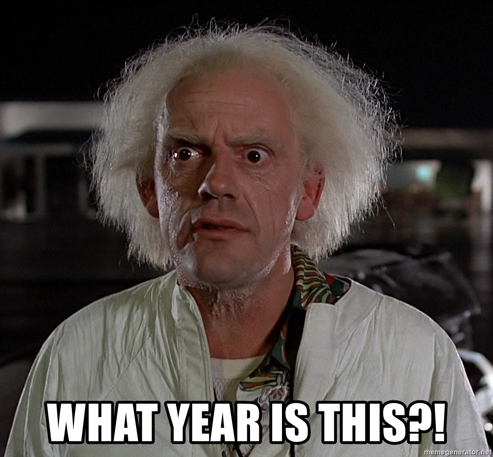

# 100 Days of code finished (My thoughts)

Well it's that time. First off I know I've been gone for awhile things have been... hectic to say the least. Moved houses and have been dealing with a lot of family issues.

Never the less I'm here to talk about finishing the #100DaysofCode challenge and my peronsonal thoughts on it. 

I want to back up a little bit here and talk a bit about what course I did and where I started to where I ended up.  

Also if you'd like to look back on my pervious posts. feel free to here.

1. *[100 Days of code Part 1](https://www.jrdevsblog.com/100-days-of-code/)*
2. *[100 Days of code Part 2](https://www.jrdevsblog.com/100-days-of-code-2/)*
3. *[100 Days of code Part 3](https://www.jrdevsblog.com/100-days-of-code-3/)*
4. *[100 Days of code Part 4](https://www.jrdevsblog.com/100-days-of-code-4/)*
5. *[100 Days of code Part 5](https://www.jrdevsblog.com/100-days-of-code-5/)*

To start I was using the website *[freecodecamp.org](https://freecodecamp.org)*
I started on the front end development track with bootstrap and then moving into other like Jquery and eventually ReactJs.

I think its important to have a strong foundational understanding of anything you are doing, now that doesn't mean you need to know every single buidling block of it or even how it's made. THe saying goes, "you must crawl before you walk, walk before you run, run before you fly."

## Compound Learning

There is also the theory of compound learning. Essesntialy what this is saying is the more you learn daily then eventually that adds up and equates to more over a period of time than on and off learning. 

From my experience in this I can say I do/did see a difference in doing coding everyday even if it was only for 1 hour It seemed as though after a few weeks it was becoming more "fluent" and I was able to solve issues that only a few weeks prior did not make sense to me. 

Is this in direct relation to "compound learning" I can't say for sure but I have see a difference in my ability to code and squash dem bugs. hahah. 

## Confidence 

I think one of the biggest improvements I saw personally for the challenge was my confidence in my abilities and the code I wrote was higher than ever without a degree (yeah I know they are just paper) and just turning 30 I felt I was a bit older and being self taught I always felt I could do better or that my code wasn't up to "par".

After the challenge and going back to see even some of my projects from before the challenge and after there is a notable differnece in how I approached problems and in using different methods I was not 100% comfortable with, you never really grow unless you push yourself. 

Let's talk about some other the lesser things I noticed throughout this. 

### Habit.

We all know the saying 7 days to make a habit and 21 to break it. Building a habit in something like learning is always beneficial that way when it's time to study or work whatever the case may be. This way it's not a "chore" or you wont dread doing it because it's just natural at that point. 

### Flow State

I don't know if anyone here has heard of the "flow state" so I'll rip off google for a sumamry of it. "In positive psychology, a flow state, also known colloquially as being in the zone, is the mental state in which a person performing some activity is fully immersed in a feeling of energized focus, full involvement, and enjoyment in the process of the activity." - Wikipedia. 

This "flow state" is something that I noticed happened to me the more I was coding not in teerms of hours in a single day but in terms of time I was doing it. THis is subjective and not everyone will feel this way about coding. However for myself it was something I noticed nappening more often. One night I got off work around 4:30pm MST went for a run like usual and ate dinner all in all I was done around 6:30 ish. I sat done to work on a personal project expecting to be done in an hour or so since I still had things to do and to sleep for work the next day. I buried my head in my laptop and the next thing I know it is 10:00pm MST.... It was like that meme where you wake up and don't know what year you're in ahhaha.

#### Conclusion

Let's wrap this all up, I want to bring home point that there are a lot of things that I have touched on in this article. I know there is alwasy cons to everything I didn't find enough in my experience in this challenge to want to speak about it very much. I was much more focused on the postivies from this because there can be so many benefits that come from a challenge like this. 

*If you'd like to join the community and make your own posts on here and share your experiences Reach to me VIA social media or Email and I'd be more than happy to feature your writings!*

