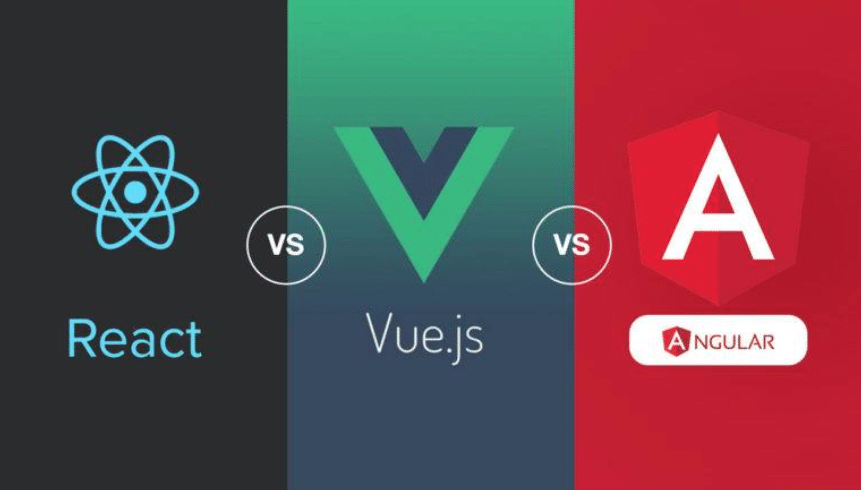

# Relearning The Basics

I've decided to go back and do some refreshers for Reactjs starting with the basics, tp be honest when I got into ReactJs I started actually with learning funcitonal hooks and not the original class method, I do see the allure of using the hooks over the aforementioned method and I think it was a natural evolution of the "library" growing over time.

### The Reason

I've talked about this in other posts of mine that having a strong foundation to anything you do is key and With React I didn't really start there I kinda jumped into the middle and then went from there. Starting at the begining is always a very humbling experience Even though I decided to literally start with the begining of react and how you have to "import" React and "import" ReactDOM. Over all it has been fun to do this and I've learning a few small things I did not know along the way which is always a good thing.

### The Focus

I'd like to transition into doing React development full time even though I tend to spread my time out between HTML5, CSS3 and vanilla Javascript, I think React is a fun library and the way it is laid out also makes a lot of sense, the reusable components are in my opinion I think how the web was originally intended to work.

### The Data

From what I've read and seen ReactJs seems to have won the internet. Not literally however they seem to be used the most between the big 3 competitors which is Vue, Angular and of course React. 

Why is it that React is the most popular library/framework I think it comes down to just how easy it to use, how versatile it is and how flexible. You can do so many things with it and there are plugins for everything you can imagine. Why reinvent the wheel you know?

### In Conclusion

React is a great choice for developers when it comes to the modern web due to the many reasons that we've talked about here and There are many more I'm sure we will cover in a later topic.

*If you'd like to join the community and make your own posts on here and share your experiences Reach to me VIA social media or Email and I'd be more than happy to feature your writings!*